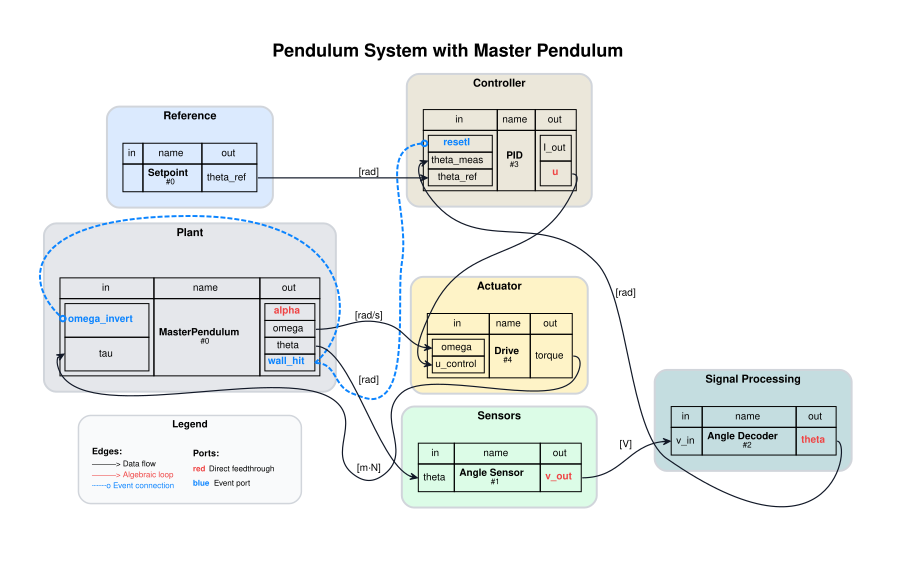
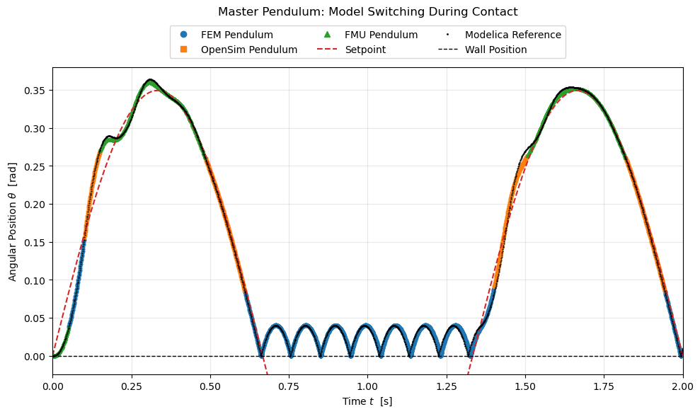

# Controlled Pendulum

Hybrid co-simulation benchmark for a torque-driven pendulum with interchangeable plant fidelity:
- `FEM` for high-fidelity structural dynamics.
- `OpenSim` for biomechanical multibody dynamics.
- `FMU` for fast Modelica-based co-simulation.

The `MasterPendulum` orchestrator composes these models behind one interface and can switch modes during runtime.






## Architecture

- **Canonical Python package**: `syssimx_examples/controlled_pendulum/`
- **Orchestrator**:
  `syssimx_examples/controlled_pendulum/orchestration/master_pendulum.py`
- **Backend adapters**:
  `syssimx_examples/controlled_pendulum/components/`
- **Modelica source models**: `src/modelica/ControlledPendulum/`
- **Generated artifacts**: `artifacts/fmus/linux/`, `artifacts/figures/`, `artifacts/results/`

Core public API:

```python
from syssimx_examples.controlled_pendulum import MasterPendulum
```

The Python example is included in the SysSimX package. Large generated FMUs
remain demo artifacts rather than wheel contents; `FMUPendulum` and
`MasterPendulum` accept `fmu_path=` when used outside a source checkout.

## Notebook Entry Points

- `notebooks/master_pendulum/`: mode-specific and combined pendulum experiments.
- `notebooks/system/no_contact/`: closed-loop baseline and algorithm verification.
- `notebooks/system/contact/`: hybrid/contact dynamics and event-driven switching.
- `notebooks/system/verification_algorithms/`: co-simulation algorithm comparison.

## FMU Workflow

Modelica FMUs can be generated/updated via:

```bash
python demos/ControlledPendulum/scripts/modelica_to_fmu.py
```

## Notes

- This demo is intended for comparative studies: fidelity vs. runtime, contact handling, and mode-switch consistency.
- Some notebooks/components require optional dependencies (e.g., OpenSim, FEM tooling, FMU tooling) available in your active environment.
