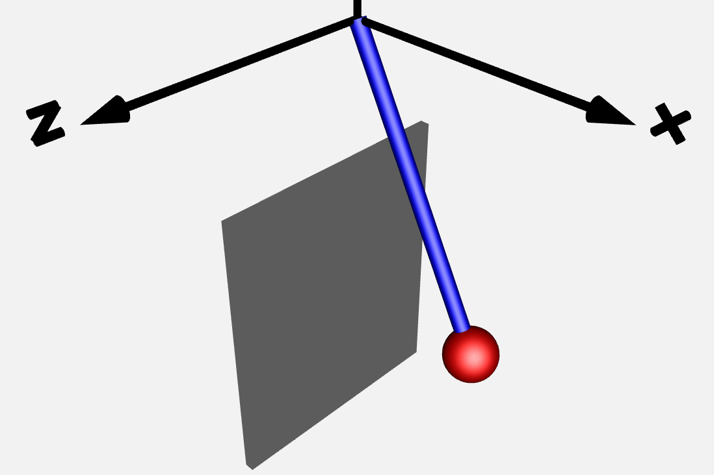

Modelica / FMU
==============

   Visualization of the Modelica Pendulum Model with wall contact.

This sequence covers a Modelica pendulum workflow from direct simulation to FMI co-simulation, then moves into hybrid event handling with rollback-based event localization.

Main takeaways across the four notebooks:

- The same pendulum dynamics are used in direct Modelica simulation (``OMPython.ModelicaSystem``) and FMU co-simulation (``syssimx.FMUComponent``).
- Solver and macro-step choices strongly affect co-simulation accuracy, especially around events.
- Discrete contact in FMUs exposes event-time sensitivity at communication boundaries when no localization strategy is used.
- Robust hybrid simulation requires reliable rollback; solver backend (Euler vs CVode) changes how rollback must be implemented.

What each tutorial does:

1. ``01_modelica_pendulum_basics``
   
   - Introduces the pendulum Modelica model with input/output interfaces.
   - Compares direct Modelica solver behavior (`dassl`, `cvode`, `euler`) and FMU behavior under the same forcing.
   - Exports FMI 2.0 co-simulation FMUs and quantifies step-size/solver accuracy differences.

2. ``02_modelica_pendulum_contact``
   
   - Extends the model with discrete wall contact using `when` and `reinit`.
   - Compares direct Modelica event localization against FMU co-simulation at different macro step sizes.
   - Shows that coarse communication steps reduce event-time observability accuracy.

3. ``03_fmu_rollback_mechanism``
   
   - Validates rollback behavior with practical snapshot/restore tests after FMU export.
   - Confirms solver-dependent behavior: Euler supports practical FMU-state restore in this setup, while CVode needs reinitialization-based restore.
   - Establishes rollback constraints needed for hybrid event localization.

4. ``04_fmu_hybrid_pendulum``
   
   - Implements a custom hybrid FMU wrapper with event indicators, rollback, and external event handling.
   - Uses the `HybridAlgorithm` for event localization and discrete updates (impact handling) without embedding events in the Modelica source.
   - Benchmarks Euler vs CVode trade-offs for hybrid simulations with frequent events.

.. toctree::
   :maxdepth: 1
   :numbered:

   01_modelica_pendulum_basics
   02_modelica_pendulum_contact
   03_fmu_rollback_mechanism
   04_fmu_hybrid_pendulum
