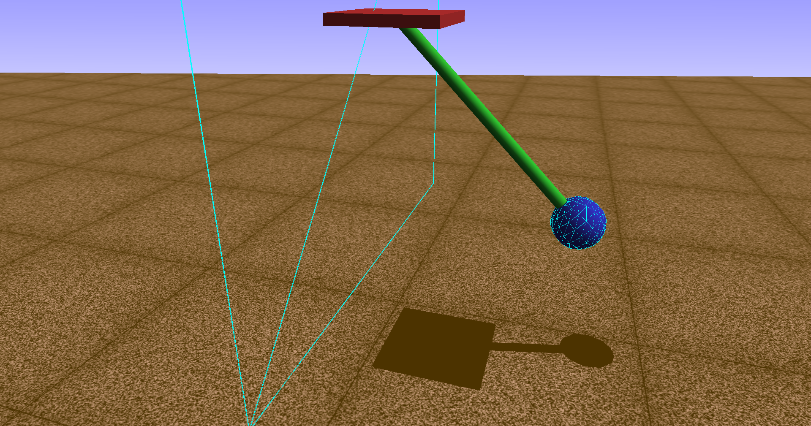

OpenSim
=======

   Visualization of the OpenSim Pendulum Model with wall contact.

This sequence builds a rigid-body pendulum in OpenSim step by step, from basic model construction to torque actuation and impact/contact behavior.

Main takeaways across the three notebooks:

- The pendulum is modeled with OpenSim's multibody hierarchy (`Model -> Body -> Joint -> Coordinate`) and simulated with the `Manager`.
- The baseline model uses a fixed base (`WeldJoint`) and a 1-DOF pendulum (`PinJoint`) with gravity-driven forward dynamics.
- Torque input is added through `CoordinateActuator`, using `overrideActuation` for direct time-step-wise torque control.
- Contact is modeled with `ContactSphere + ContactHalfSpace` and `HuntCrossleyForce`, enabling physically motivated collisions with dissipation.

What each tutorial does:

1. ``01_opensim_pendulum_basics``
   
   - Builds the pendulum model from scratch (bodies, joints, coordinate, visualization geometry).
   - Sets initial conditions and runs free-swing simulation under gravity.
   - Extracts and plots angle/velocity/acceleration histories and performs a basic parameter comparison.

2. ``02_opensim_pendulum_torque``
   
   - Adds a pivot torque via `CoordinateActuator` and direct actuation override.
   - Runs constant-torque cases with gravity off and on.
   - Verifies OpenSim trajectories against an analytical rigid-body ODE reference and studies torque magnitude effects.

3. ``03_opensim_pendulum_contact``
   
   - Extends the actuated model with wall contact using Hunt-Crossley force formulation.
   - Simulates free-swing and torque-driven repeated impacts.
   - Studies how dissipation controls rebound energy loss and how stiffness trades penetration against collision sharpness/numerical stiffness.

.. toctree::
   :maxdepth: 1
   :numbered:

   01_opensim_pendulum_basics
   02_opensim_pendulum_torque
   03_opensim_pendulum_contact
