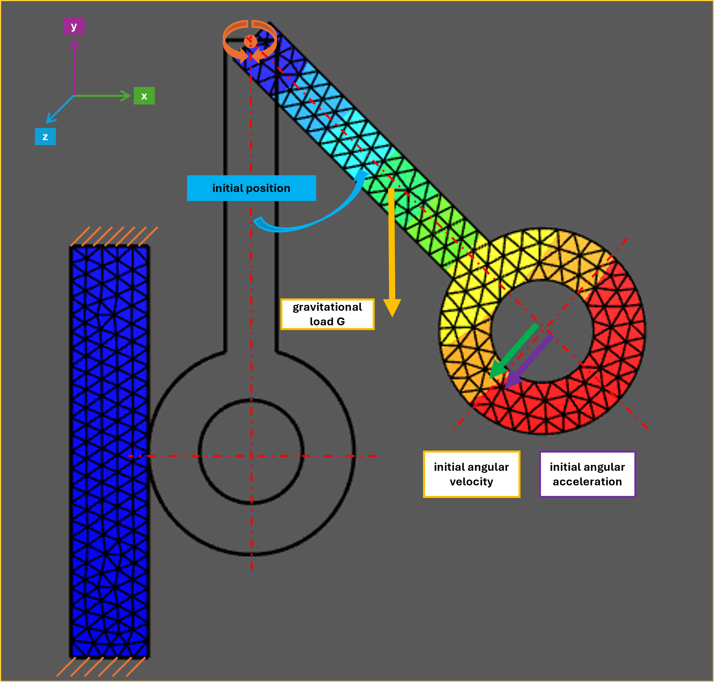

Netgen/NGSolve
==============

   Visualization of the Modelica Pendulum Model with wall contact.

This sequence builds a nonlinear, deformable pendulum model step by step using Netgen/NGSolve, starting from core dynamics and extending to actuation and contact.

Main takeaways across the three notebooks:

- The pendulum is modeled as a 2D hyperelastic body (Neo-Hookean, plane strain) with nonlinear elastodynamics.
- A hinge-like pivot is enforced with a mixed FE formulation (`VectorH1 + NumberSpace`) using mean-zero displacement constraints on the rotation edge.
- Time integration is performed with Newmark-style updates and nonlinear solves (`Variation(...)` + Newton minimization).
- A rigid-body proxy angle is extracted from the deformable solution for interpretation and verification.

What each tutorial does:

- ``01_fem_pendulum_basics``

  - Builds geometry/mesh, material law, FE spaces, and the full weak form (internal energy, inertia, gravity, hinge constraint).
  - Runs transient simulation and visualizes displacement and stress evolution.
  - Establishes the baseline model (no external torque, no contact).

- ``02_fem_pendulum_torque``

  - Adds pivot actuation by converting a desired torque into a zero-resultant traction distribution on the hinge boundary.
  - Implements this as a follower load so the traction remains normal to the deformed boundary during large rotations.
  - Verifies behavior with/without follower load and compares FEM response to a rigid-body reference (gravity off/on).

- ``03_fem_pendulum_contact``

  - Extends the actuated pendulum with wall contact by adding a second body and a contact boundary pair.
  - Uses an incremental normal-gap penalty energy to resist penetration and tracks minimum contact gap for diagnostics.
  - Compares non-adaptive vs adaptive time stepping for energy behavior and studies stiff vs compliant pendulum responses during impact.

.. toctree::
   :maxdepth: 1
   :numbered:

   01_fem_pendulum_basics
   02_fem_pendulum_torque
   03_fem_pendulum_contact
